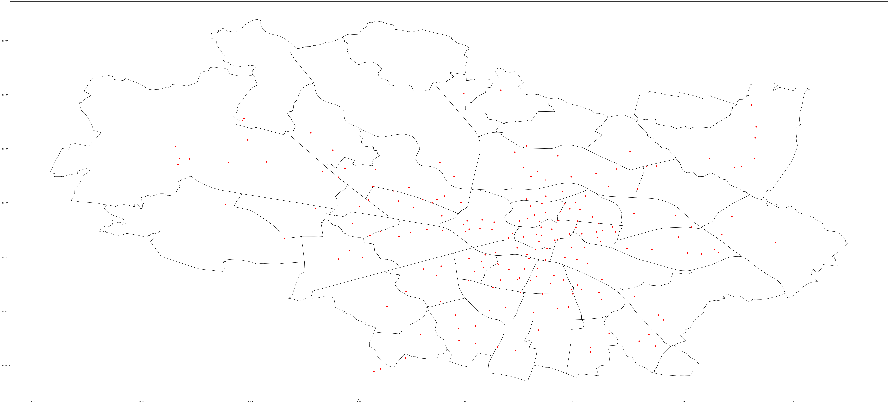
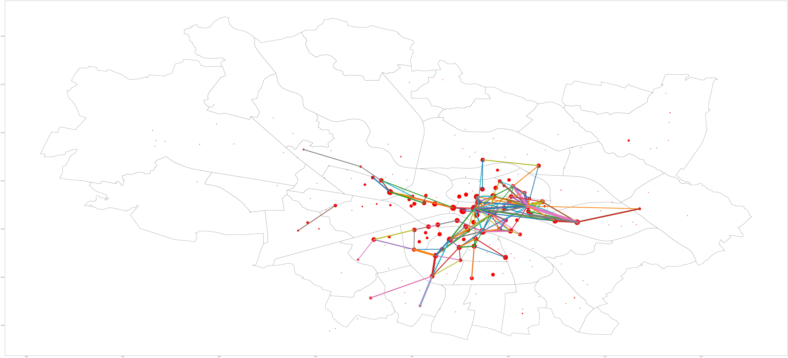

# wod-bike-dataset-generator

## WebApp installation

```bash
cd application
npm install
npm run start
```

### Deployment
```bash
npm run deploy
```

## Mapped network nodes on Wroclaw map


## Map for 03 2019, scaled base on edge weight and node degree

### only display edges with weight > 20
