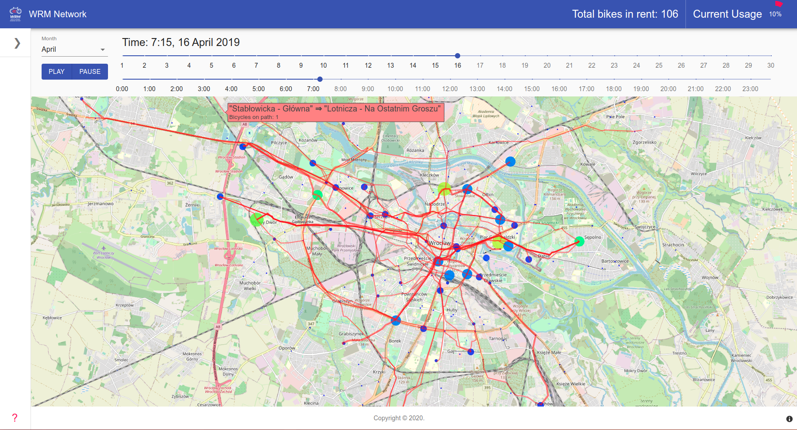

# Temporal Network of bicycle usage in Wroclaw (PL)
<!-- ALL-CONTRIBUTORS-BADGE:START - Do not remove or modify this section -->
[](#contributors-)
<!-- ALL-CONTRIBUTORS-BADGE:END -->



[Application website](https://burnpiro.github.io/wod-bike-dataset-generator/)

## Github Large File Storage

For large file storeage we need to use [Github LFS](https://git-lfs.github.com/). Please follow the instruction and install it on your machine.

## Preprocessing
1. To preprocess the dataset, you need to execute the following notebook
preprocessing/preprocessing.ipynb

2. To execute the notebook, you need:
    -  dataset (directory `data` with monthly rentals)
    -  pickle with Wroclaw stations (`preprocessing/stations.pkl`)

3.  Preprocessed data with csv extension will be saved in data_preprocessed directory.
    - File with map from id to station name will be saved in `data_preprocessed/nodes.csv` file.

4. Output sample:
```
bike_number, start_time, end_time, rental_place, return_place
57114, 2019-03-15 10:21:55, 2019-03-15 10:28:18, 195, 195 
```

where rental_place and return_place are id from map from file `data_preprocessed/nodes.csv`

Example `nodes.csv`:

```markdown
value, name
0, Aleja Bielany
```

## Groupby Intervals

Prepcosessed files can be used for generation of the dataset of 15 minutes intervals. For each interval we count number of trips between two places A and B. If a trip lasts more then 15 minutes it will be reordered in more then one interval (depending on its duration). 

We trips in intervals as rows of a dataframe where each row describes interval start, its end, the number of trips made in this interval, rental place and return place

Example record:

```
interval_start, interval_end, number_of_trips, rental_place, return_place
2019-06-30, 15:30:00, 2019-06-30 15:45:00, 1, 97, 154
```

More details about this process in `15 Minutes Interval Parser Notebook` where we present generation of gropedby intervals for an example month

To generate gropedby intervals for every month you need to preprocess every month (See [Preprocessing](#preprocessing)). If you generate this files now you only need to execute [generate_groupby_intervals_datasets.py](generate_groupby_intervals_datasets.py) which will create new folder called groupedby_intervals in with intervals for each month. 

## Convert Groupby Intervals to JSON format

When u generenate groupedby_interval files for each month, you can convert them into jsons so they can be easily used in the webapp. In order to do that execute the  [convert_bikes_usage_to_json.py](convert_bikes_usage_to_json.py) file. Generated jasons will have a fomrat explained in [Json-coding-edges](#json-coding---edges) section of a readme. 


More details about this process in `Convert 15 Minutes Interval To Json.ipynb` where we presrent generation of gropedby intervals jsons for an example month

## Metrics

List of metrics per station:
- Degree
- In Degree
- Out Degree
- PageRank

Station metrics are stored in `./metrics_json/historia_przejazdow_*.json` and in `./metrics/historia_przejazdow_*.csv`.

Network usage metrics:
- Bikes in use
- Total bikes available in current month
- Bike usage in percentage

Network usage is stored in `./bike_usage_json/historia_przejazdow_*.json` and in `./bike_usage/historia_przejazdow_*.csv`.


## Path generation
To generate csv file with paths you need to have `./network/nodes_locations.csv` file already available.

Execute notebook (watch out, it's memory consuming, and takes ages ~7h):
```
OSMNX - path generation.ipynb
```

File with paths should be separate files depends on accuracy:
 ```markdown
./application/app_data/paths_reduced-e7.json
./application/app_data/paths_reduced-e8.json
./application/app_data/paths_reduced-e9.json
./application/app_data/paths_reduced-e10.json
./application/app_data/paths_reduced-e11.json
./application/app_data/paths_reduced-e12.json
```

Additionally, it will create file with nodes:
```markdown
./application/public/nodes_list.json
```

## WebApp installation

```bash
cd application
npm install
npm run start
```

### Deployment
```bash
npm run deploy
```

## Mapped network nodes on Wroclaw map


### Json coding - edges
```
{"rental_place":"o","return_place":"d","number_of_trips":"c"}
```

```
{
    <day>: {
           <start_minute>: [
                    {
                            "o": <int>,
                            "d": <int>,
                            "c": <int>,
                    }
             ]
     }
}
```

Example:

```
{
   1: {
           375: [
                    {
                            "o": 1,
                            "d": 2,
                            "c": 15,
                    }
             ]
     }
}
```

### Json coding - nodes metrics
```
{"node": "o", "degree": "k", "in_degree": "ik", "out_degree": "ok", "pagerank": "p"}
```

```
{
    <day>: {
           <start_minute>: [
                    {
                            "o": <int>,
                            "k": <int>,
                            "ik": <int>,
                            "ok": <int>,
                            "p": <float>,
                    }
             ]
     }
}
```

Example:

```
{
   "1": {
           "375": [
                    {
                            "o": 1,
                            "k": 2,
                            "ik": 1,
                            "ok": 1,
                            "p": 0.03103880199262298,
                    }
             ]
     }
}
```

### Json coding - bikes usage
```
{"bikes_in_use": "bu", "bikes_total": "bt", "bikes_percentage": "bp"}
```

```
{
    <day>: {
           <start_minute>: [
                    {
                           "bu": <int>,
                           "bt": <int>,
                           "bp": <float>,
                    }
             ]
     }
}
```

Example:

```
{
   "1": {
           "375": [
                    {
                           "bu": 366,
                           "bt": 1027,
                           "bp": 0.3563777994157741,
                    }
             ]
     }
}
```

## Contributors ✨

Thanks goes to these wonderful people ([emoji key](https://allcontributors.org/docs/en/emoji-key)):

<!-- ALL-CONTRIBUTORS-LIST:START - Do not remove or modify this section -->
<!-- prettier-ignore-start -->
<!-- markdownlint-disable -->
<table>
  <tr>
    <td align="center"><a href="https://github.com/dkunc"><br /><sub><b>dkunc</b></sub></a><br /><a href="https://github.com/burnpiro/wod-bike-dataset-generator/commits?author=dkunc" title="Code">💻</a> <a href="https://github.com/burnpiro/wod-bike-dataset-generator/commits?author=dkunc" title="Documentation">📖</a> <a href="https://github.com/burnpiro/wod-bike-dataset-generator/pulls?q=is%3Apr+reviewed-by%3Adkunc" title="Reviewed Pull Requests">👀</a></td>
  </tr>
</table>

<!-- markdownlint-enable -->
<!-- prettier-ignore-end -->
<!-- ALL-CONTRIBUTORS-LIST:END -->

This project follows the [all-contributors](https://github.com/all-contributors/all-contributors) specification. Contributions of any kind welcome!