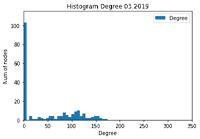
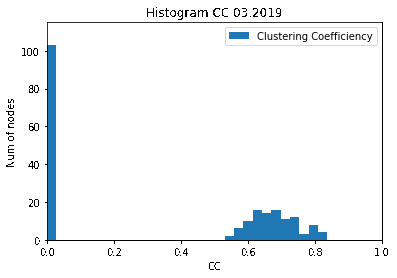
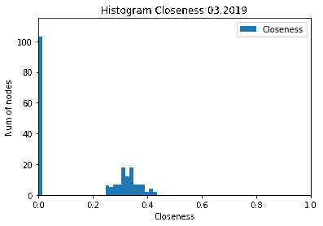
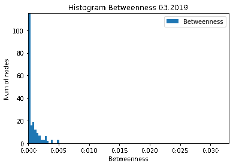

# wod-bike-dataset-generator

## Mapped network nodes on Wroclaw map


## Map for 03 2019, scaled base on edge weight and node degree

### only display edges with weight > 20


### Animated network 2019

### Networks month/month 2019
[Full networks](./assets/2019-full-images.zip)

### Animated network 2019 (degree only)


### Degree distribution change


### Clustering Coefficent distribution change


### Closeness distribution change


### Betweenness distribution change


### Generating files

To generate edges weights and metrics for all nodes in each interval you have to run generate_groupby_intervals_datasets.py and then run generate_all_metrics.py. Generated files with weighted edges already are in groupedby_intervals directory. Files containing metrics for nodes (.*metrics.csv) and bikes usage (.*bikes_usage.csv) are in metrics directory.


### Json coding
```
{"interval_start":"s","rental_place":"o","return_place":"d","number_of_trips":"c"}
```
